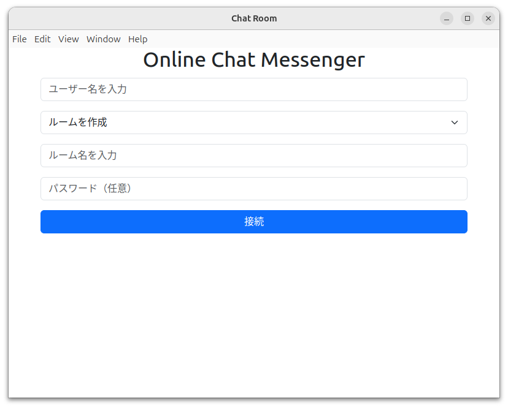
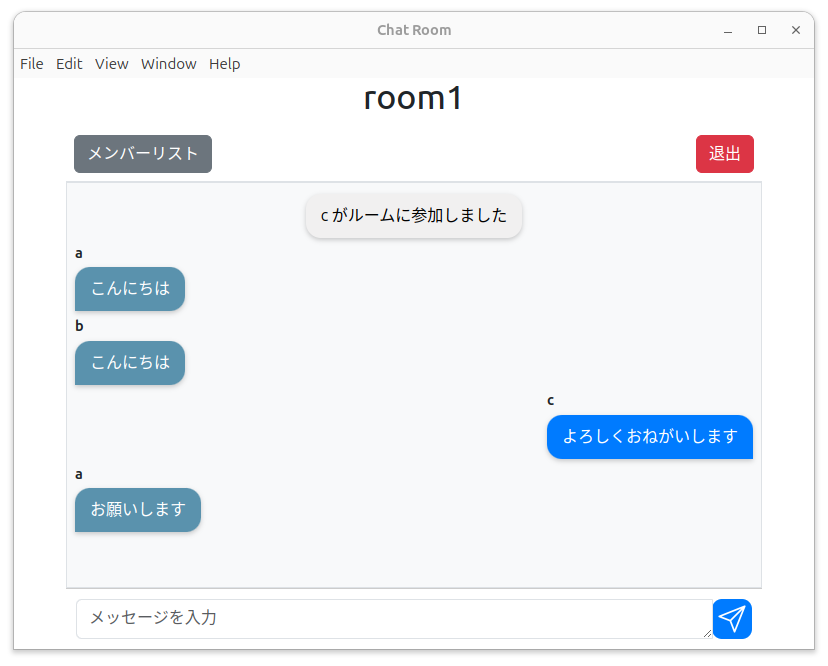
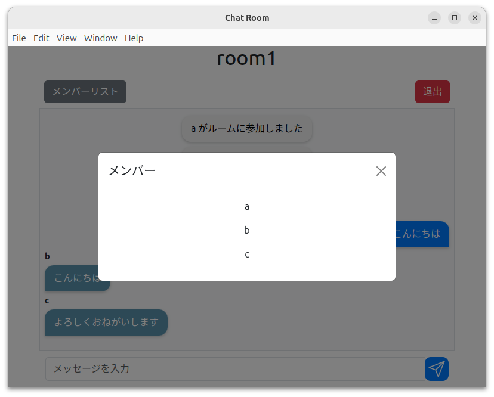
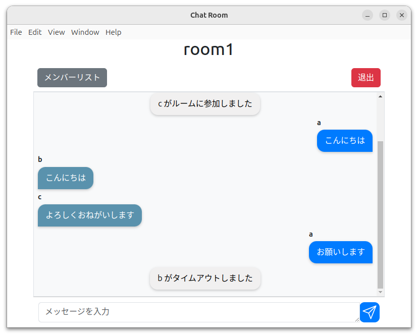
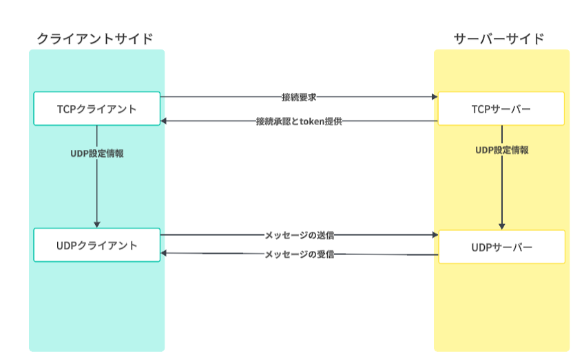

# Online-Chat-Messenger

# 概要
このアプリケーションでは、ユーザーはチャットルームを作成したり、既存のルームに参加したりして、他のユーザーとリアルタイムでコミュニケーションを取ることができます。通信はTCPとUDPプロトコルを使用し、RSA暗号化によりデータの安全なやり取りを実現しています。
|  |  |
|:---:|:---:|
|  |  |

## 機能
- **チャットルームの作成または参加:** 新しいチャットルームを作成するか、既存のルームに参加できます。
- **安全な通信:** メッセージはRSA暗号化を使用して安全に送受信されます。
- **リアルタイムメッセージング:** チャットルーム内でリアルタイムでメッセージを送受信できます。
- **タイムアウト処理:** 一定時間アクティブでないクライアントは、自動的にチャットルームから退出されます。
- **ルーム解散機能** ホストが退出したらクライアント全員が、自動的にチャットルームから退出されます。
- **パスワード認証** チャットルームの作成者は、作成したチャットルームに参加するための任意のパスワードを設定することができます。
  
## 使用技術
- [Electron](https://www.electronjs.org/): デスクトップアプリケーションフレームワーク
- [Node.js](https://nodejs.org/): JavaScriptランタイム
- [Python](https://www.python.org/): サーバーサイドの言語としてTCPとUDP接続を管理
- [ソケットプログラミング](https://docs.python.org/3/library/socket.html): TCPおよびUDPソケットによるネットワーク通信
- [RSA暗号化](https://cryptography.io/en/latest/hazmat/primitives/asymmetric/rsa/): メッセージのセキュリティを保つための公開鍵・秘密鍵暗号化

## 必要条件
- Node.js
- Python 3.x
- Python 用の RSA暗号化ライブラリ `pycryptodome` （`pip install pycryptodome` でインストール可能）
- NodeJS のための RSA暗号化ライブラリ `node-rsa` (`npm install node-rsa` でインストール可能)

## アプリケーション実行方法

1. このリポジトリをクローンします:
    ```bash
    git clone https://github.com/chat-teamdev-b/Online-Chat-Messenger.git
    ```

2. 必要な依存関係をインストールします:
    ```bash
    cd Online-Chat-Messenger
    npm init -y
    npm install -D electron
    pip install pycryptodome
    npm install node-rsa
    ```

3. サーバーを起動します:
    ```bash
    python3 stage3/src/server.py
    ```

4. Electronアプリケーションを起動します:
    ```bash
    npx stage3/src/electron .
    ```

## 使用方法

1. **チャットルームを作成:**
   - ユーザー名、ルーム名、（任意で）パスワードを入力します。
   - 「作成」を選択し、「接続」をクリックして新しいチャットルームを作成します。
   
2. **チャットルームに参加:**
   - ユーザー名、ルーム名、そしてルームのパスワード（必要な場合）を入力します。
   - 「参加」を選択し、「接続」をクリックして既存のチャットルームに参加します。

3. **メッセージの送信:**
   - ルームに接続後、メッセージ入力欄にメッセージを入力し、「送信」をクリックします。

## インフラ構成図
|  |
|:---:|

## ディレクトリ構成
<pre>
.

├── README.md
├── images
    ├── chart.png
    ├── screen1.png
    ├── screen2.png
    ├── screen3.png
    ├── screen4.png
└── stage3
    └── src
        ├── index.html
        ├── main.js
        ├── package.json
        ├── preload.js
        ├── renderer.js
        ├── renderer.png
        ├── server.py
        └── styles.css
</pre>

# 注意事項
サーバーおよびクライアントは同じネットワーク内で動作する必要があります。  
サーバーのIPアドレスとポート番号は、環境に合わせて適宜変更してください。

詳細な実装は各ファイルのソースコードを参照してください。
